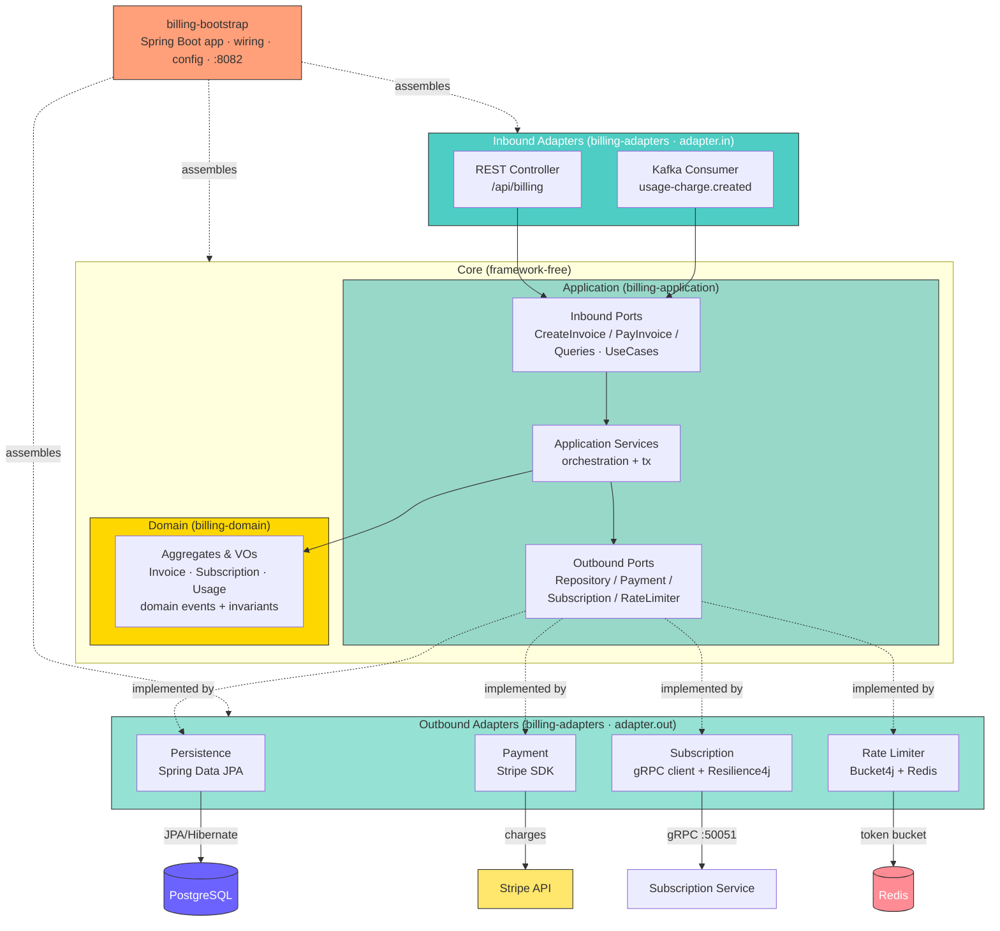

# Billing Service

A Spring Boot 4 microservice that handles payment processing, invoice generation, and usage-based billing for the SaaS platform. It integrates with **Stripe** for payment processing, consumes usage-charge events from **Kafka**, and communicates with the subscription-service via **gRPC**.


## Architecture

The service follows a **Domain-Driven Design / hexagonal (ports & adapters)** layout split across four Gradle modules. The domain and application core have **no framework dependencies**; all I/O crosses through ports implemented by adapters. Dependencies point inward — `adapters` and `bootstrap` depend on `application`, which depends on `domain`; `domain` depends on nothing. This boundary is enforced by an ArchUnit test.



## Tech Stack

| Concern | Technology |
|---|---|
| Runtime | Java 21 |
| Framework | Spring Boot 4 |
| Build | Gradle 9 |
| Database | PostgreSQL (Spring Data JPA / Hibernate) |
| Cache / Rate Limiting | Redis + Bucket4j (Lettuce) |
| Messaging | Apache Kafka (Avro + Confluent Schema Registry) |
| Payment | Stripe Java SDK |
| Internal RPC | gRPC (Buf Registry) |
| Resilience | Resilience4j (circuit breaker + retry) |
| API Docs | SpringDoc OpenAPI / Swagger UI |
| Observability | OpenTelemetry (Spring Boot starter), Actuator |
| Code Quality | JaCoCo, SonarQube |
| Testing | JUnit 5, Testcontainers, Spring REST Docs |

## Features

- **Stripe integration** — creates payment intents, handles charges, and manages invoices
- **Kafka consumer** — processes `billing.usage-charge.created` Avro events from the usage pipeline
- **gRPC client** — fetches subscription details from subscription-service with Resilience4j circuit breaker and exponential-backoff retry
- **Redis rate limiting** — per-endpoint token-bucket rate limiting via Bucket4j + Lettuce
- **REST API** — billing endpoints documented via Swagger UI at `/swagger-ui.html`
- **OpenTelemetry** — distributed traces, metrics, and logs exported via OTLP
- **Health & metrics** — Spring Actuator endpoints (`/actuator/health`, `/actuator/metrics`, `/actuator/prometheus`)

## Project Structure

Four Gradle modules, wired together by `billing-bootstrap`. Package root is `com.project.billing`.

```
billing-service/
├── billing-domain/              # Pure domain — no framework deps
│   └── src/main/java/.../domain/
│       ├── invoice/             # Invoice aggregate + value objects
│       ├── subscription/        # Subscription aggregate
│       ├── usage/               # Usage aggregate + domain events (event/)
│       ├── shared/              # Shared value objects
│       └── exception/           # Domain exceptions
│
├── billing-application/         # Use cases + ports (framework-free)
│   └── src/main/java/.../application/
│       ├── invoice/
│       │   ├── port/in/         # Inbound ports (CreateInvoice/PayInvoice/Queries)
│       │   ├── port/out/        # Outbound ports (Repository/Payment/Subscription)
│       │   └── service/         # Application services (orchestration)
│       ├── usage/               # Usage use cases + ports + service
│       ├── shared/port/out/     # Shared outbound ports (e.g. RateLimiter)
│       └── exception/           # Application-level exceptions
│
├── billing-adapters/            # Ports & adapters implementations
│   ├── src/main/java/.../adapter/
│   │   ├── in/rest/             # REST controller + DTOs + mapper
│   │   ├── in/messaging/        # Kafka Avro consumer
│   │   ├── out/persistence/     # Spring Data JPA repository adapter
│   │   ├── out/payment/         # Stripe payment adapter (+ config)
│   │   ├── out/subscription/    # gRPC client adapter (+ config)
│   │   ├── out/messaging/       # Kafka producer (+ config)
│   │   └── out/ratelimit/       # Bucket4j + Redis adapter (+ config)
│   └── src/main/{avro,proto}/   # Avro (.avsc) + Protobuf schema definitions
│
├── billing-bootstrap/           # Spring Boot app — wiring, config, entrypoint
│   └── src/main/
│       ├── java/.../config/     # Spring @Configuration (beans, OTel, etc.)
│       └── resources/
│           ├── application.properties
│           ├── application-cred.properties   # secrets (gitignored)
│           └── logback-spring.xml
│
├── settings.gradle              # Module includes
├── build.gradle
└── Dockerfile
```

> Architecture boundaries (domain ← application ← adapters/bootstrap) are enforced by an ArchUnit test in `billing-bootstrap`.

## Getting Started

### Prerequisites

- Java 21
- Gradle 9 (or use the included `./gradlew` wrapper)
- PostgreSQL
- Redis
- Kafka + Confluent Schema Registry
- Stripe account (API key)
- Running subscription-service (gRPC on port 50051)

### Configuration

The service reads from `application.properties`. Secrets are loaded from `application-cred.properties` (not committed). Key properties:

```properties
# Database
spring.datasource.url=jdbc:postgresql://localhost:5434/billing_db
spring.datasource.username=billing_user
spring.datasource.password=billing_password

# Stripe
stripe.api.key=${STRIPE_API_KEY}

# Kafka
spring.kafka.bootstrap-servers=localhost:9092
spring.kafka.consumer.properties.schema.registry.url=http://localhost:9094

# Redis
spring.data.redis.host=localhost
spring.data.redis.port=6379

# gRPC → subscription-service
grpc.subscription.host=localhost
grpc.subscription.port=50051

# OpenTelemetry
management.otlp.metrics.export.url=http://localhost:43180/v1/metrics
management.opentelemetry.tracing.export.otlp.endpoint=http://localhost:43180/v1/traces
```

Create `billing-bootstrap/src/main/resources/application-cred.properties` with your secrets:

```properties
stripe.api.key=sk_test_...
```

### Build & Run

```bash
# Build all modules (skips tests)
./gradlew build -x test

# Run (bootRun lives in the bootstrap module)
./gradlew :billing-bootstrap:bootRun

# Or run the fat JAR
java -jar billing-bootstrap/build/libs/billing-bootstrap-0.0.1-SNAPSHOT.jar
```

### Testing

```bash
# Run all tests (requires Docker for Testcontainers)
./gradlew test

# Generate JaCoCo coverage report
./gradlew jacocoTestReport
# Report at: build/reports/jacoco/test/html/index.html
```

### SonarQube Analysis

```bash
./gradlew sonar \
  -Dsonar.host.url=http://localhost:9000 \
  -Dsonar.login=<token>
```

## API

Swagger UI: `http://localhost:8082/swagger-ui.html`  
OpenAPI JSON: `http://localhost:8082/api-docs`

### Key Endpoints

| Method | Path | Description |
|---|---|---|
| `POST` | `/api/billing/invoices` | Create an invoice (returns `201 Created`) |
| `GET` | `/api/billing/invoices/{id}` | Fetch an invoice by ID (returns `200 OK`) |
| `POST` | `/api/billing/invoices/{id}/pay` | Pay an invoice via Stripe; returns the payment status |
| `GET` | `/api/billing/active?userId={userId}` | List active subscriptions for a user |
| `GET` | `/actuator/health` | Health check |
| `GET` | `/actuator/prometheus` | Prometheus metrics |

## Kafka Events Consumed

| Topic | Schema | Action |
|---|---|---|
| `billing.usage-charge.created` | `UsageChargeCreatedEvent` (Avro) | Processes usage charges and creates invoices |

## Resilience

**Circuit Breaker** (`subscriptionGrpc`):
- Sliding window: 10 calls
- Failure threshold: 50%
- Wait in open state: 10s
- Auto-transition to half-open: enabled

**Retry** (`subscriptionGrpc`):
- Exponential backoff (multiplier: 2, base: 300ms)
- Retries on: `StatusRuntimeException`
- Ignores: `IllegalArgumentException`

**Retry** (`stripePayment`):
- Max attempts: 2
- Wait: 1s

## Docker

```bash
docker build -t billing-service .
docker run -p 8082:8082 \
  -e STRIPE_API_KEY=sk_test_... \
  billing-service
```

## CI/CD

GitHub Actions workflows in `.github/workflows/`:

- `billing-service-ci.yml` — build, test, SonarQube analysis on push/PR
- `billing-service-cd.yml` — build & push Docker image on merge to main
- `test.yml` — standalone test runner

## License

MIT
## Security & Guardrails

Container supply-chain guardrails run in CI and locally — see [`policy/README.md`](policy/README.md).

- **Dockerfile Policy as Code** — OPA/Rego via `conftest` (`policy/docker/`): hard-gates unpinned/`:latest` base images, `USER root` final stages, and `ADD <remote-url>`; warns on missing `USER`/`HEALTHCHECK`, tag-not-digest, `apt` without `--no-install-recommends`, etc.
- **Checkov** — Dockerfile + secret scanning (baseline/report mode).
- **Trivy** — image scanning **before push** in the build pipeline (fail-closed on fixable CRITICAL/HIGH), plus `trivy fs` (deps) and `trivy config` (misconfig) on PRs. Complements source-level scanning (e.g. SonarQube).

```bash
./scripts/guardrails.sh   # conftest + checkov + trivy (skips tools not installed)
```

CI: [`.github/workflows/security.yml`](.github/workflows/security.yml) (PR gate) + the Trivy image scan wired into the build workflow.
