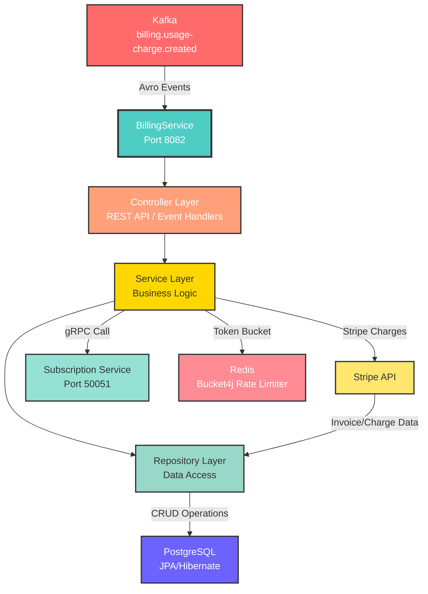

# Billing Service

A Spring Boot 4 microservice that handles payment processing, invoice generation, and usage-based billing for the SaaS platform. It integrates with **Stripe** for payment processing, consumes usage-charge events from **Kafka**, and communicates with the subscription-service via **gRPC**.


## Architecture



## Tech Stack

| Concern | Technology |
|---|---|
| Runtime | Java 21 |
| Framework | Spring Boot 4 |
| Build | Gradle 9 |
| Database | PostgreSQL (Spring Data JPA / Hibernate) |
| Cache / Rate Limiting | Redis + Bucket4j (Lettuce) |
| Messaging | Apache Kafka (Avro + Confluent Schema Registry) |
| Payment | Stripe Java SDK |
| Internal RPC | gRPC (Spring gRPC) |
| Resilience | Resilience4j (circuit breaker + retry) |
| API Docs | SpringDoc OpenAPI / Swagger UI |
| Observability | OpenTelemetry (Spring Boot starter), Actuator |
| Code Quality | JaCoCo, SonarQube |
| Testing | JUnit 5, Testcontainers, Spring REST Docs |

## Features

- **Stripe integration** — creates payment intents, handles charges, and manages invoices
- **Kafka consumer** — processes `billing.usage-charge.created` Avro events from the usage pipeline
- **gRPC client** — fetches subscription details from subscription-service with Resilience4j circuit breaker and exponential-backoff retry
- **Redis rate limiting** — per-endpoint token-bucket rate limiting via Bucket4j + Lettuce
- **REST API** — billing endpoints documented via Swagger UI at `/swagger-ui.html`
- **OpenTelemetry** — distributed traces, metrics, and logs exported via OTLP
- **Health & metrics** — Spring Actuator endpoints (`/actuator/health`, `/actuator/metrics`, `/actuator/prometheus`)

## Project Structure

```
billing-service/
├── src/
│   ├── main/
│   │   ├── java/com/project/billing_service/
│   │   │   ├── controller/      # REST controllers (BillingController, HealthController)
│   │   │   ├── service/         # Business logic
│   │   │   ├── client/          # gRPC client to subscription-service
│   │   │   ├── events/          # Kafka Avro consumer
│   │   │   ├── model/           # JPA entities + DTOs
│   │   │   ├── repository/      # Spring Data repositories
│   │   │   ├── config/          # Stripe, Redis, Kafka, gRPC, OTel config
│   │   │   └── exceptions/      # Exception handlers
│   │   ├── avro/                # Avro schema definitions (.avsc)
│   │   ├── proto/               # Protobuf definitions
│   │   └── resources/
│   │       ├── application.properties
│   │       └── application-cred.properties  # secrets (gitignored)
│   └── test/                    # Unit + integration tests (Testcontainers)
├── build.gradle
└── Dockerfile
```

## Getting Started

### Prerequisites

- Java 21
- Gradle 9 (or use the included `./gradlew` wrapper)
- PostgreSQL
- Redis
- Kafka + Confluent Schema Registry
- Stripe account (API key)
- Running subscription-service (gRPC on port 50051)

### Configuration

The service reads from `application.properties`. Secrets are loaded from `application-cred.properties` (not committed). Key properties:

```properties
# Database
spring.datasource.url=jdbc:postgresql://localhost:5434/billing_db
spring.datasource.username=billing_user
spring.datasource.password=billing_password

# Stripe
stripe.api.key=${STRIPE_API_KEY}

# Kafka
spring.kafka.bootstrap-servers=localhost:9092
spring.kafka.consumer.properties.schema.registry.url=http://localhost:9094

# Redis
spring.data.redis.host=localhost
spring.data.redis.port=6379

# gRPC → subscription-service
grpc.subscription.host=localhost
grpc.subscription.port=50051

# OpenTelemetry
management.otlp.metrics.export.url=http://localhost:43180/v1/metrics
management.opentelemetry.tracing.export.otlp.endpoint=http://localhost:43180/v1/traces
```

Create `src/main/resources/application-cred.properties` with your secrets:

```properties
stripe.api.key=sk_test_...
```

### Build & Run

```bash
# Build (skips tests)
./gradlew build -x test

# Run
./gradlew bootRun

# Or run the fat JAR
java -jar build/libs/billing-service-0.0.1-SNAPSHOT.jar
```

### Testing

```bash
# Run all tests (requires Docker for Testcontainers)
./gradlew test

# Generate JaCoCo coverage report
./gradlew jacocoTestReport
# Report at: build/reports/jacoco/test/html/index.html
```

### SonarQube Analysis

```bash
./gradlew sonar \
  -Dsonar.host.url=http://localhost:9000 \
  -Dsonar.login=<token>
```

## API

Swagger UI: `http://localhost:8082/swagger-ui.html`  
OpenAPI JSON: `http://localhost:8082/api-docs`

### Key Endpoints

| Method | Path | Description |
|---|---|---|
| `POST` | `/api/billing/charge` | Create a charge via Stripe |
| `GET` | `/api/billing/invoices/{userId}` | List invoices for a user |
| `GET` | `/actuator/health` | Health check |
| `GET` | `/actuator/prometheus` | Prometheus metrics |

## Kafka Events Consumed

| Topic | Schema | Action |
|---|---|---|
| `billing.usage-charge.created` | `UsageChargeCreatedEvent` (Avro) | Processes usage charges and creates invoices |

## Resilience

**Circuit Breaker** (`subscriptionGrpc`):
- Sliding window: 10 calls
- Failure threshold: 50%
- Wait in open state: 10s
- Auto-transition to half-open: enabled

**Retry** (`subscriptionGrpc`):
- Exponential backoff (multiplier: 2, base: 300ms)
- Retries on: `StatusRuntimeException`
- Ignores: `IllegalArgumentException`

**Retry** (`stripePayment`):
- Max attempts: 2
- Wait: 1s

## Docker

```bash
docker build -t billing-service .
docker run -p 8082:8082 \
  -e STRIPE_API_KEY=sk_test_... \
  billing-service
```

## CI/CD

GitHub Actions workflows in `.github/workflows/`:

- `billing-service-ci.yml` — build, test, SonarQube analysis on push/PR
- `billing-service-cd.yml` — build & push Docker image on merge to main
- `test.yml` — standalone test runner

## License

MIT
